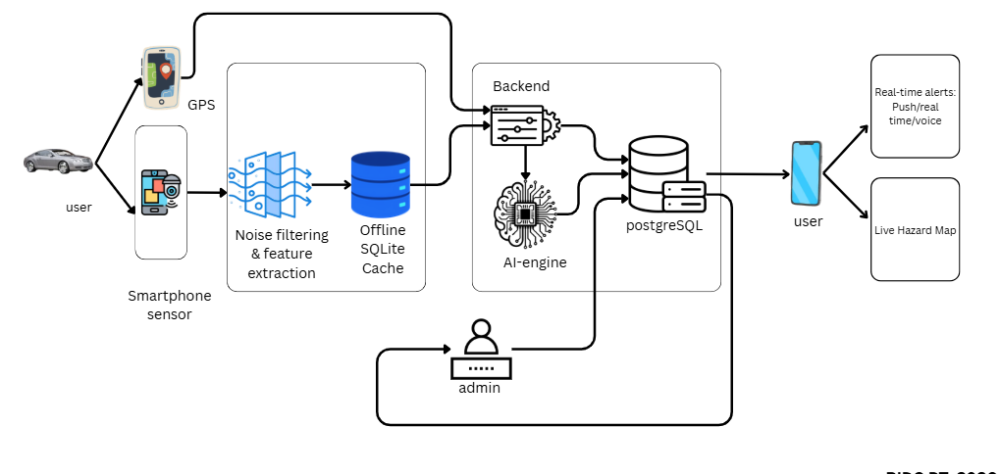
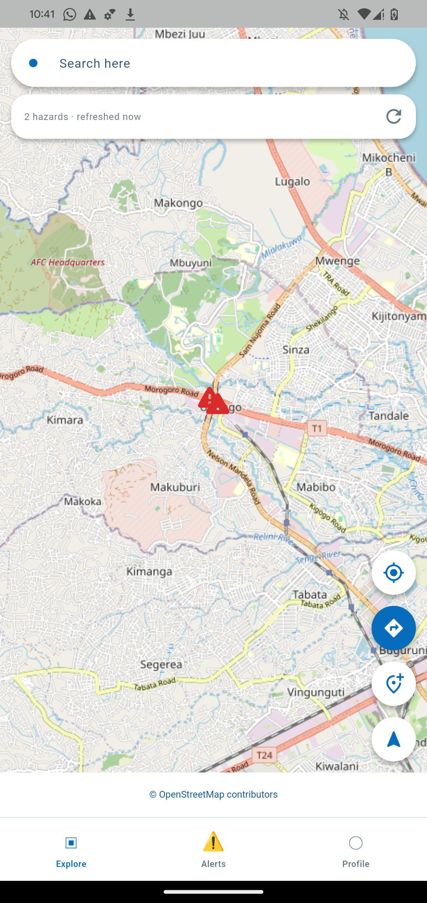
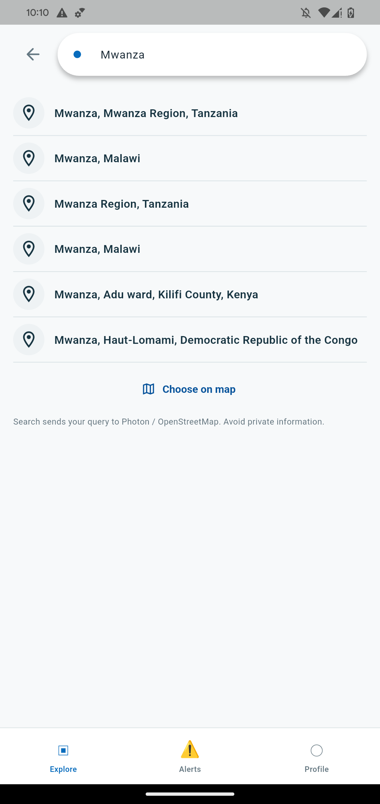
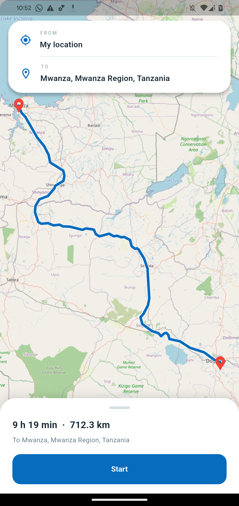

# RoadGuard AI

**Drivers' phones find potholes. Other drivers get warned before they reach them.**

RoadGuard AI is a road-condition monitoring system for Tanzania. While people drive, their smartphones measure the road with the motion sensors and GPS they already have. An AI model spots the jolt of a pothole in that data. When several different drivers' phones hit the same spot, RoadGuard marks it as a hazard and warns the next drivers heading that way, by voice and on a live map. Road officers see every spot, its severity and the evidence in a web portal, and follow it until it is repaired.

Drivers can also report a pothole themselves with a photo, while stopped.

> This file is the overview of the whole project. Each part has its own detailed README (see [Documentation](#11-documentation)).

---

## Contents

1. [The problem and the idea](#1-the-problem-and-the-idea)
2. [Conceptual diagram](#2-conceptual-diagram)
3. [Who uses it](#3-who-uses-it)
4. [How it works](#4-how-it-works)
5. [The parts of the system](#5-the-parts-of-the-system)
6. [Screenshots](#6-screenshots)
7. [Requirements and where they are met](#7-requirements-and-where-they-are-met)
8. [Key decisions and rules](#8-key-decisions-and-rules)
9. [Project status](#9-project-status)
10. [Running it](#10-running-it)
11. [Documentation](#11-documentation)
12. [History](#12-history)
13. [Please check (points to confirm)](#13-please-check-points-to-confirm)

---

## 1. The problem and the idea

**The problem.** Potholes damage vehicles and cause accidents. Road agencies such as **TARURA** (Tanzania Rural and Urban Roads Agency) have many kilometres of road to inspect and learn about new damage slowly, often only after someone complains. Drivers usually find a pothole when they hit it.

**The idea: crowd sensing.** Every smartphone has an accelerometer, a gyroscope and GPS. A car hitting a pothole produces a typical jolt in those sensors. If many drivers share their sensor data while they drive:

- an **AI model** can recognise the jolts and say *where and when* each phone hit a pothole;
- when **several different phones** report the same spot, it is very likely a real pothole, not one driver's bump;
- the spot's **severity** can be measured from how hard the phones were jolted;
- **drivers who come later are warned** in time, and **officers** get a live, evidence-based list of road damage without having to find it themselves.

In short: *the first drivers who pass a pothole protect the ones who come after them.*

---

## 2. Conceptual diagram



What each part of the diagram is today:

| Diagram part | What it is in the system | Status |
|---|---|---|
| **User + smartphone sensors** | The mobile app records the accelerometer (raw, gravity included) and gyroscope during a trip, only with the driver's explicit consent | ✅ Built |
| **GPS** | Every sensor reading carries its GPS position, speed and accuracy. Mocked, stale or inaccurate (> 25 m) positions are rejected | ✅ Built |
| **Noise filtering & feature extraction** | Turning raw readings into the model's 34 inputs. Done **on the server** (`ai_engine/`), copied from the AI team's notebook; on the phone later, if needed | ✅ Built (server) |
| **Offline SQLite cache** | The app keeps sensor batches and reports in SQLite on the phone until the server confirms receipt, so nothing is lost without signal | ✅ Built |
| **Backend** | One Django backend serves the mobile app and the web portal | ✅ Built |
| **AI engine** | The AI team's sensor model runs in the backend (`ai_engine.sensor_model.PotholeEngine`) on every sensor batch; its detections are stored and grouped | ✅ Connected (needs local retraining) |
| **PostgreSQL** | PostgreSQL 17 with **PostGIS 3.6** for the spatial questions ("within 15 m", "inside this map area") | ✅ Built |
| **Admin** | The web portal for Admins and TARURA officers: dashboard, map, reports, review, users, audit log | ✅ Built |
| **User → Live hazard map** | The app's Explore map shows hazards, refreshed every 5 seconds | ✅ Built |
| **User → Real-time alerts: voice / real time** | During a trip the app warns about potholes ahead on the route, on screen and by voice ("Pothole in 150 metres") | ✅ Built (app open) |
| **User → Real-time alerts: push** | Alerts when the app is in the background or the screen is off | ❌ Not built yet |

---

## 3. Who uses it

| Who | Uses | Can do |
|---|---|---|
| **Driver (traveller)** | Mobile app (Android, Flutter) | Sign in (required), see hazards on a live map, search places, get routes with turn-by-turn voice navigation and pothole warnings, report a pothole with a photo while stopped, optionally share sensor data during trips |
| **TARURA Officer** | Web portal | See defects on the dashboard and map, look at the evidence (photo, number of phones, severity), review them: *Verified*, *Under Repair*, *Resolved*, with a note |
| **Admin** | Web portal | Everything an officer can do, plus invite and manage portal users, manage road authorities, read the audit log |
| **AI engine** | Backend "socket" | Receives sensor batches and returns pothole detections (in-process Python class or separate HTTP service) |

Portal accounts sign in with a password **and** an authenticator-app code (MFA). Traveller accounts are separate from portal accounts, and photo reports are **anonymous**: officers never see who sent them.

---

## 4. How it works

### 4.1 A driver reports a pothole (photo)

```
driver stops ─► takes a photo ─► app checks GPS (standing still, ≤ 25 m accuracy)
   ─► saved on the phone ─► uploaded anonymously ─► backend strips photo metadata,
   looks up road name + region ─► new defect "New" in the portal ─► officer reviews it
```

- A report is only accepted while the car is **standing still** (GPS speed ≤ 0.5 m/s) with an accurate, fresh, real GPS fix. This keeps drivers from using the phone while moving.
- The photo is re-encoded, so it carries **no GPS or camera metadata**. Officers see it in the portal's review panel.
- An unreviewed report is **not** shown to other drivers. It becomes a public hazard when an officer verifies it, or when enough phones detect the same spot (§4.2).

### 4.2 Phones detect a pothole (crowd sensing)

```
driver A's phone ─┐                       ┌─ 2+ phones: spot appears in the portal ("New", source "device")
driver B's phone ─┼─► AI engine ─► detections within 15 m ─► one spot ─┤
driver C's phone ─┘                       └─ 3+ phones: drivers are warned ("reported by drivers")
```

1. During a trip, a signed-in driver who agreed to share sensor data uploads a **batch** of readings about every 2 seconds (accelerometer + gyroscope at a requested 10 Hz, each with GPS).
2. The **AI engine** analyses each batch and returns detections: time, place, confidence and how hard the hit was.
3. Detections from different phones within **15 m** of each other are grouped into one **spot** (PostGIS `ST_DWithin`).
4. **2 different phones** → the spot appears in the portal for officers to monitor. **3 different phones** → other drivers are warned.
5. The spot's numbers:
   - **confidence** combines the phones: 1 − Π(1 − cᵢ). Three phones at 80 % give 99.2 %.
   - **severity** is the confidence-weighted average hit strength: *low* below 0.4, *medium* below 0.7, *high* above.
6. An officer's **Verified** turns it into a "confirmed" hazard. **Resolved** removes it. A crowd spot with no new detection for 30 days stops being alerted.

Phones are counted by a keyed hash of the traveller account, so the system knows they are *different* phones without storing *who* they are.

### 4.3 A driver is warned

- **Before the trip:** the Explore map shows confirmed hazards and crowd-reported spots, labelled differently, refreshed every 5 seconds.
- **During the trip:** the app asks the backend about every 15 seconds for hazards around the driver (about 450 m each way). When one lies on the chosen route (within 30 m) and 20–250 m ahead, the driver sees a banner and hears **"Pothole in 150 metres"**. Each hazard warns once per trip, and the warning is kept in the Alerts tab.
- **Turn-by-turn navigation**, like Google Maps or Waze: next manoeuvre, spoken directions, time and distance left, and automatic rerouting. Voice prompts wait so they never talk over a hazard warning.

### 4.4 An officer follows it up

Officers open a defect in the portal. They see:
- the road, region and position
- the traveller's photo, if there is one
- how many phones detected it, and the severity

They set its status (*Verified → Under Repair → Resolved*) with a note. The server stamps **who** reviewed it and **when** from the logged-in session, and every change is written to the **audit log**.

---

## 5. The parts of the system

| Part | Folder | Technology |
|---|---|---|
| **Mobile app** (drivers) | [`Mobile app/`](Mobile%20app/) | Flutter 3.47 / Dart 3.13, Riverpod, SQLite, flutter_map + OpenStreetMap, GPS, camera, text-to-speech |
| **Backend** (shared by app and portal) | [`Web portal/new-backend/`](Web%20portal/new-backend/) | Python, Django 6.1, Django REST framework 3.18 (class-based `APIView`s), GraphQL for the app, PostgreSQL 17 + PostGIS 3.6 |
| **Web portal** (officers, admins) | [`Web portal/frontend/`](Web%20portal/frontend/) | React 19 + TypeScript + Vite, **axios**, TanStack Query, Leaflet |
| **AI models** | [`ai/`](ai/), run by `Web portal/new-backend/ai_engine/` | Sensor model (scikit-learn Random Forest): **connected**. Photo model (YOLOv8, Ultralytics): **connected**, checks report photos as advice for officers (§9) |
| **External services** | — | OpenStreetMap map tiles, **Photon** place search and road names, **OSRM** routes with turn-by-turn steps (free public servers) |

```
ROADGUARD/
├── README.md                ← this file
├── docs/                    ← conceptual diagram and screenshots used here
├── Mobile app/              ← Flutter traveller app (its own README and docs/)
├── Web portal/
│   ├── README.md            ← backend + portal: setup, API, security, crowd sensing, AI socket
│   ├── new-backend/         ← Django backend (apps: roadguard, mobile, telemetry, detection)
│   └── frontend/            ← React web portal
├── ai/                      ← trained models from the AI team
│   ├── pothole_model_bundle.pkl   (sensor model)
│   └── yolo-best.pt               (photo model)
└── .vscode/launch.json      ← "Mobile app" run setting with the server address
```

How the pieces talk:

```
 Phone app ── REST  /api/v1/mobile/auth/...            traveller accounts
           ── REST  /api/v1/anonymous/report-photos/   report photo (anonymous)
           ── GraphQL /api/v1/graphql/anonymous/           reports, hazards, place search, routes
           ── GraphQL /api/v1/graphql/mobile/              sensor-sharing consent + uploads
                              │
                     Django backend ──► PostgreSQL + PostGIS
                              │   ▲
      AI engine ── /api/v1/ai/... ┘   └── REST /api/v1/... ── React web portal (axios)
```

---

## 6. Screenshots

Taken on a Pixel 4 connected to the backend on 2026-09-25.

| Live hazard map | Place search | Route with trip time |
|---|---|---|
|  |  |  |
| Two hazards on Morogoro Road (Ubungo), loaded from the backend | Real places from Photon / OpenStreetMap | Dodoma → Mwanza by road, from OSRM |

*The web portal has no screenshots here yet.*

---

## 7. Requirements and where they are met

### 7.1 Course requirements

| # | Requirement | Status | Where |
|---|---|---|---|
| 1 | Django models | ✅ | `roadguard/models.py`, `mobile/models.py`, `telemetry/models.py`, `detection/models.py` |
| 2 | Connection to an external database | ✅ | PostgreSQL + PostGIS, configured in `config/settings.py` from `.env` |
| 3 | Django migrations | ✅ | Each app's `migrations/`. They also enable PostGIS and add the spatial columns |
| 4 | DRF class-based `APIView` endpoints | ✅ | `roadguard/views.py`, `auth_views.py`, `mobile/views.py`, `detection/views.py` |
| 5 | React consumes the endpoints with axios | ✅ | `frontend/src/lib/api.ts`, one shared axios instance |

Details: [`Web portal/README.md` §1](Web%20portal/README.md#1-project-requirements-checklist).

### 7.2 Main SRS requirements (`RoadGuard_AI_SRS.pdf`)

| SRS item | Status | Notes |
|---|---|---|
| Flutter app with a minimal, low-distraction driving UI | ✅ | Material 3, large controls, voice guidance |
| UC-04 Route planning | ✅ | Real routes (OSRM), alternatives, turn-by-turn navigation |
| UC-07 Manual pothole report with photo | ✅ | Photo required, standing-still rule, anonymous upload |
| UC-17 Moderation by officers | ✅ | Web portal review with MFA, stamping and audit log |
| UC-23 Sensor collection | ✅ foreground | With explicit consent, only while the trip screen is open |
| Edge-first offline storage (SQLite) | ✅ | Reports and sensor batches wait on the phone until the server confirms |
| Stationary enforcement for reporting | ✅ with exception | ≤ 0.5 m/s instead of exactly 0 (see §8) |
| Algorithmic corroboration (independent devices, DBSCAN-style grouping) | ✅ | 15 m grouping in PostGIS; 2 phones to track, 3 to alert |
| Hands-free warnings | ✅ foreground | Voice and banner during trips; **push** not built |
| Anonymous reports, metadata stripped | ✅ | Photo re-encoded; no identity attached |
| TLS 1.2+ | ⏳ | Release builds require HTTPS; local testing uses a USB/Wi-Fi tunnel |
| Battery ≤ 5 % extra per hour | ⏳ Not measured | Needs measurements on real phones |
| 100,000 trips, < 500 ms lookups | ⏳ Not measured | Spatial indexes are in place; no load test yet |
| Server-side erasure within 24 h | ❌ | Only local deletion on the phone so far |

The full mapping is in [`Mobile app/docs/SRS_TRACEABILITY.md`](Mobile%20app/docs/SRS_TRACEABILITY.md). Parts of that file predate the backend connection.

---

## 8. Key decisions and rules

| Decision | Why |
|---|---|
| **Potholes only**: road cracks are out of scope and refused | The sensors and model are about potholes. Cracks can't be felt by a phone |
| **Sign-in required** in the app (no guest mode) | Sensor sharing and crowd counting need to know that phones are *different* |
| **No demo or sample mode**: the app is production | Every route, hazard and report is real; nothing made-up is ever shown as real |
| **Standing still = GPS speed ≤ 0.5 m/s**, accuracy ≤ 25 m | A phone at rest reports small speed drift, so "exactly 0" blocked genuine reports. A **documented exception to the SRS**; app and backend enforce the same limits |
| **2 phones to track, 3 phones to alert** | One phone's bump is not enough evidence; the crowd rule protects drivers from false alarms |
| **Unreviewed photo reports are not shown to drivers** | An officer, or enough phones, must confirm first |
| **One backend** for app and portal | One database, so a report or detection appears in the portal at once |
| **PostGIS without GeoDjango** | Same spatial power without the heavy GDAL install on every Windows machine |
| **Privacy by design** | Anonymous reports, photo metadata removed, phones counted by a keyed hash, sensor sharing opt-in and stoppable any time |

---

## 9. Project status

**Working now (verified 2026-09-25 on a Pixel 4 over Wi-Fi):**
- Traveller sign-up and login, live hazard map, place search, routes with turn-by-turn navigation (long routes fall back to no steps on a slow link), trip times like "9 h 19 min".
- Anonymous photo reports that appear in the portal as *New* defects, with the photo visible to officers.
- Sensor sharing with consent, stored in PostGIS and waiting for the AI engine.
- Crowd-sensing logic (grouping, severity, publishing), tested with simulated detections.
- Web portal with MFA, invitations, roles, review stamping and audit log.
- The AI team's **sensor model runs in the backend** on every sensor batch; the portal shows an AI engine card and each spot's detections.
- The AI team's **photo model (YOLOv8) checks every report photo**; the portal shows its verdict under the photo and outlines the potholes it found.
- Tests: backend **104 pass**, Flutter app **154 pass**.

**AI models** in [`ai/`](ai/). Both models are connected (details: `Web portal/new-backend/ai_engine/models/MODEL.md`). Still to settle with the AI team:

| Model | What it is | Open questions |
|---|---|---|
| Sensor model (`pothole_model_bundle.pkl`) | Random Forest, 34 features from 2-second windows at 5 Hz, speed ≥ 10 km/h. Precision 0.43, recall 0.75. **Connected** | Confirm units and gravity; retrain on local data at 10 Hz; orientation; hit-strength formula; thresholds |
| Photo model (`yolo-best.pt`) | YOLOv8, one class "pothole", mAP50 0.55. **Connected**: checks each report photo; officers see the verdict and outlined potholes next to the photo (advice only) | Confidence cut-off (0.25, provisional); retrain on local photos (recall 0.54); AGPL-3.0 licence of Ultralytics |

**Not built yet:**
- Push notifications and alerts in the background or with the screen off
- Noise filtering and feature extraction on the phone
- Portal pages for crowd numbers and the audit log
- Real email sending
- HTTPS deployment
- Server-side data erasure
- Battery and load measurements

See [`Web portal/README.md` §21](Web%20portal/README.md#21-known-limitations-and-next-steps).

---

## 10. Running it

There are two ways: **with Docker** (everything in containers, production-like) or **without Docker** (for development, with automatic reloading). Use one at a time: both use port 8000.

### 10.1 Running with Docker

Three containers, started together by [`docker-compose.yml`](docker-compose.yml):

| Container | What it is | Reached at |
|---|---|---|
| `web` | nginx: the built web portal, and the door to the backend | **http://localhost:8000** (this PC only) |
| `backend` | Django + both AI models, run by gunicorn; applies migrations on start | through `web`: `/api/v1/...` |
| `db` | PostgreSQL 18 + PostGIS 3.6 (it reads the Windows PostgreSQL 17 data unchanged); data in the Docker volume `roadguard-db` | only by `backend` |

The phone app needs no change: it still calls `http://127.0.0.1:8000`, forwarded to this PC by the ADB tunnel.

**Needs:** Docker Desktop, running.

**First time** (from `D:\ROADGUARD`):
```powershell
powershell -ExecutionPolicy Bypass -File docker\init-env.ps1     # creates docker\.env with new secrets
docker compose up -d --build                                     # builds and starts (first build takes a while)
powershell -ExecutionPolicy Bypass -File docker\copy-data.ps1    # copies your data from the Windows PostgreSQL
```
`init-env.ps1` keeps the backend's existing secret key (it also makes the anonymous phone ids crowd sensing counts). `copy-data.ps1` only *reads* the Windows database, which stays as it is, and refuses to overwrite data already made in Docker. Afterwards you may stop the Windows service `postgresql-x64-17` so it isn't used by mistake.

**Every day:**

| Task | Command |
|---|---|
| Start (and rebuild after code changes) | `docker compose up -d --build` |
| Is it healthy? | `docker compose ps` (all three `healthy`) |
| Backend log | `docker compose logs -f backend` |
| Stop (data is kept) | `docker compose down` |
| A management command | `docker compose exec backend python manage.py create_admin` |
| Back up the database | `powershell -ExecutionPolicy Bypass -File docker\backup.ps1` → `docker\backup\` |
| Run the backend tests in Docker | `docker compose exec backend python manage.py test ai_engine mobile roadguard detection telemetry` |
| Build without the photo AI (slow connection) | `$env:WITH_PHOTO_AI="0"; docker compose up -d --build` |

**Restore a backup** (replaces the Docker data with the file's):
```powershell
docker compose stop backend web
docker compose cp docker\backup\<file>.dump db:/tmp/restore.dump
docker compose exec db dropdb -U roadguard --force roadguard
docker compose exec db createdb -U roadguard roadguard
docker compose exec db pg_restore -U roadguard -d roadguard --no-owner --no-privileges /tmp/restore.dump
docker compose up -d
```

**Settings** are in `docker\.env` (git-ignored; template `docker\.env.example`). Debug is off, and the site answers only to `localhost`/`127.0.0.1`.

**Troubleshooting**

| Problem | Fix |
|---|---|
| `failed to connect to the docker API` | Start Docker Desktop and wait until it says *Engine running* |
| `port is already allocated` / `bind ... 8000` | Something else uses port 8000, usually `manage.py runserver`. Stop it |
| The build stops while downloading torch | Run the build again (finished steps are reused), or build without the photo AI (see above) |
| `backend` stays `starting` / `unhealthy` | `docker compose logs backend` shows the error (e.g. a migration) |
| `copy-data.ps1`: *already holds RoadGuard data* | Data was already copied or made in Docker; nothing was changed. `-Force` replaces it (Docker-made data is lost) |
| Where are invitation emails? | No mail server is set up, so emails are stored, and with debug off the `/dev/outbox/` page is hidden. Show the newest: `docker compose exec backend python manage.py shell -c "from roadguard.models import OutboxEmail as E; e=E.objects.latest('created_at'); print(e.to_email, e.subject, e.body, sep='\n')"` |

### 10.2 Running without Docker

Short version (Windows). The full steps are in [`Web portal/README.md` §3](Web%20portal/README.md#3-getting-started) and [§15](Web%20portal/README.md#15-connecting-the-mobile-app).

1. **Database:** PostgreSQL 17 with PostGIS running (service `postgresql-x64-17`).
2. **Backend:**
   ```powershell
   cd "D:\ROADGUARD\Web portal\new-backend"
   .venv\Scripts\python manage.py runserver 8000
   ```
3. **Web portal:**
   ```powershell
   cd "D:\ROADGUARD\Web portal\frontend"
   npm run dev
   ```
   Then open http://localhost:5173.
4. **Mobile app:** build it with the server address (`--dart-define=ROADGUARD_API_URL=http://127.0.0.1:8000`, already set in VS Code's "Mobile app" run setting). Then connect the phone:
   ```powershell
   powershell -ExecutionPolicy Bypass -File "D:\ROADGUARD\Mobile app\tool\connect_wifi.ps1"
   ```
   After a reinstall or restart, see *Restoring the connection* in the Web portal README §15.

---

## 11. Documentation

| Document | For |
|---|---|
| [`Web portal/README.md`](Web%20portal/README.md) | Backend and portal: setup, configuration, API, MFA, roles, audit log, tests, mobile connection, navigation, crowd sensing, AI socket, PostGIS |
| [`Web portal/new-backend/docs/AI_ENGINE_CONTRACT.md`](Web%20portal/new-backend/docs/AI_ENGINE_CONTRACT.md) | The AI team: exact input and output of the AI engine |
| [`Mobile app/README.md`](Mobile%20app/README.md) | The Flutter app: features, safety and privacy rules, structure, quality commands |
| [`Mobile app/docs/`](Mobile%20app/docs/) | App architecture, SRS traceability, permissions, GraphQL contract, validation notes. Some pages predate the backend connection |

---

## 12. History

| Date (2026) | Milestone |
|---|---|
| Before September | SRS written (`RoadGuard_AI_SRS.pdf`). Flutter traveller app built from the RIDC Flutter template, first with sample data |
| 21 September | App connected to live services (first backend, in a separate project) |
| 22 September | Photo model (YOLOv8) trained |
| 24 September | Portal backend rebuilt from FastAPI to **Django + DRF** to meet the course requirements; mobile endpoints moved into the same backend; sensor model bundle produced |
| 24–25 September | PostGIS installed; crowd sensing and severity; AI engine socket; turn-by-turn navigation; road cracks removed; sign-in required; demo code removed; failing app tests fixed |
| 25 September | Phone connected to the server over Wi-Fi; routing made reliable on slow connections; readable trip times; officers can see travellers' photos in the portal; AI models reviewed |

---

## 13. Please check (points to confirm)

I wrote this from the code, the other READMEs, the conceptual diagram and our conversations. Please correct anything that's wrong, especially:

1. **Organisation and course.** The diagram is marked "RIDC PT 202…" and the app follows the "RIDC Flutter template". Is this a practical-training project at RIDC? What's the institution's full name, the course name and the team members?
2. **Client.** Is **TARURA** the intended user organisation (the portal has a "TARURA Officer" role)? Is TANROADS involved as well?
3. **Pilot area.** Testing so far used Dar es Salaam (Morogoro Road, Ubungo) and Dodoma. Is there an official pilot area?
4. **The problem statement** in §1 is my wording. Replace it with the project's own if you have one, e.g. from the SRS introduction.
5. **The AI team**: names, and who owns the models in `ai/`.
6. **SRS status table (§7.2):** the requirement names are from `Mobile app/docs/SRS_TRACEABILITY.md`. The SRS PDF itself isn't in this folder. Add it if you'd like it linked.
7. **History dates** before 21 September.
